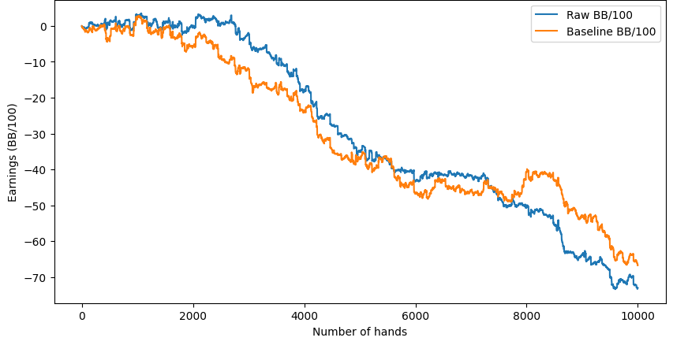

# Poker AI: RichieRich

RichieRich is an advanced AI-powered No-Limit Texas Hold'em Poker game. It uses cutting-edge algorithms like **Counterfactual Regret Minimization (CFR)**, **Monte Carlo Markov Chain (MCMC) sampling**, and **Deep Q-Networks (DQN)** to deliver a challenging and strategic poker-playing experience. Designed with scalability and computational feasibility in mind, RichieRich offers a realistic, competitive environment for players and researchers.

---

## Table of Contents
1. [Features](#features)
2. [How It Works](#how-it-works)
   - [Game Abstraction](#game-abstraction)
   - [Blueprint Strategy with CFR](#blueprint-strategy-with-cfr)
   - [MCMC Sampling](#mcmc-sampling)
   - [DQN for Poker](#dqn-for-poker)
   - [Real-Time Decision Making](#real-time-decision-making)
3. [Installation](#installation)
4. [Usage](#usage)
5. [Project Structure](#project-structure)
6. [Training the AI](#training-the-ai)
7. [Contributing](#contributing)
8. [License](#license)
9. [Acknowledgments](#acknowledgments)

---

## Features
- **Dynamic Poker AI**: An AI opponent powered by advanced algorithms to simulate professional-level poker strategies.
- **Preflop and Postflop Strategies**: Dedicated strategies for each stage of the game.
- **Game Abstraction**: Simplified decision-making through card and action clustering.
- **CFR Training**: Self-play training that converges to unexploitable strategies.
- **MCMC Sampling**: Probabilistic sampling to evaluate game states and optimize decisions.
- **DQN for Poker**: Reinforcement learning with neural networks for decision-making in complex scenarios.
- **Graphical Interface**: Intuitive Pygame-powered interface for manual play and game replays.
- **Custom Training Support**: Generate datasets to refine and retrain the AI.

---

## How It Works

### Game Abstraction
To manage the immense complexity of poker:
1. **Card Abstraction**: Hands are grouped based on similar equity (probability of winning) into clusters, such as 169 preflop clusters.
2. **Action Abstraction**: Bet sizes are simplified into representative actions (e.g., fold, call, half-pot, pot-size).

This reduces the number of scenarios the AI needs to evaluate, balancing efficiency and strategic accuracy.

---

### Blueprint Strategy with CFR
The AI trains using **Counterfactual Regret Minimization (CFR)**:
- CFR minimizes regret for suboptimal decisions over iterative self-play.
- This training converges to a **Nash Equilibrium** for two-player zero-sum games, ensuring unexploitable strategies.

---

### MCMC Sampling
Monte Carlo Markov Chain (MCMC) sampling is utilized to simulate possible game outcomes by probabilistically exploring game states. MCMC enables the AI to:
- Evaluate the likelihood of winning for various decisions based on sampled rollouts.
- Refine strategies dynamically by learning from game outcomes in uncertain scenarios.

This method is particularly effective for estimating probabilities in large, complex games like poker.

---

### DQN for Poker
Deep Q-Networks (DQN) leverage reinforcement learning with neural networks to improve decision-making. In this approach:
- The AI learns to map game states (e.g., card distributions, pot sizes) to optimal actions (e.g., raise, call, fold).
- The neural network approximates a Q-value function, which predicts the expected reward for each action.
- The DQN implementation allows the AI to adapt to evolving strategies, making it highly effective for handling dynamic, multi-stage games.

---

### Real-Time Decision Making
During gameplay:
1. The AI maps the current game state to its abstracted model.
2. It retrieves an action from its strategy (CFR, MCMC, or DQN).
3. The decision is adapted to the real game context (e.g., determining the exact bet size).

This ensures the AI remains both responsive and strategically sound.

---

## Installation

1. Clone the repository:
   ```bash
   git clone https://github.com/yourusername/poker-ai.git
   cd poker-ai
   ```

2. Install dependencies:
   ```bash
   pip install -r requirements.txt
   ```

3. Install Pygame if not already installed:
   ```bash
   pip install pygame
   ```

---

## Usage

Run the game with:
```bash
python game/poker_main.py
```

### Command Line Arguments
- `-p` or `--play`: Play against the AI manually.
- `-r` or `--replay`: Replay previously saved games.
- `-g` or `--god`: Enable "God mode" to see the AI's cards.

#### Examples
- To play against the AI:
   ```bash
   python game/poker_main.py --play
   ```
- To replay historical games:
   ```bash
   python game/poker_main.py --replay
   ```

---

## Project Structure
```
poker-ai/
│
├── game/                # Main game logic and interface
│   ├── poker_main.py    # Main game loop
│   ├── DQN_game.ipynb   # Alternate DQN implementation
│   ├── poker_MCMC.ipynb # Alternate MCMC implementation
│   └── ...
│
├── src/                 # AI logic and abstractions
│   ├── abstraction.py   # Card and action abstraction logic
│   ├── postflop_holdem.py # Postflop strategy implementation
│   ├── preflop_holdem.py # Preflop strategy implementation
│   └── ...
│
├── assets/              # Game assets (e.g., images, sounds)
│
├── dataset/             # Pre-generated training datasets
│
└── requirements.txt     # Python dependencies
```

---

## Training the AI

### Generating New Datasets
To generate datasets for training:
```bash
python src/abstraction.py
```

### Training Parameters
- Training runs in batches of **50,000 hands**.
- Uses CFR, MCMC, and DQN to optimize learning.

---

## Results and Analysis

### 1. CFR Abstraction for Preflop Strategy


- **Observation**: The graph shows the declining performance in terms of "Earnings (BB/100)" over the course of 7,000 hands.
- **Insights**:
  - **Raw BB/100** reflects the performance of the CFR abstraction-based strategy.
  - **Baseline BB/100** represents the unoptimized approach without abstraction.
  - While the CFR abstraction model improves initial performance, the lack of postflop strategies results in long-term decline.

---

### 2. Double DQN Learning Curve


- **Observation**: The average reward fluctuates across 100,000 episodes, with an upward trend indicating gradual improvement.
- **Insights**:
  - **Double DQN** leverages reinforcement learning to optimize actions in Limit Hold'em.
  - Fluctuations highlight the complexity of balancing exploration and exploitation.
  - The upward trend suggests that the DQN model learns to improve over time, despite the challenges of the dynamic poker environment.

---

### 3. CFR Preflop and Postflop Comparison


- **Observation**: The graph shows **Earnings (BB/100)** for both baseline and CFR strategies over 10,000 hands.
- **Insights**:
  - **Raw CFR Strategy** slightly outperforms the baseline initially but faces similar long-term decline.
  - Indicates the need for stronger postflop strategies and more robust abstraction techniques to sustain performance.

---

## Key Learnings and Future Directions

1. **CFR Effectiveness**:
   - CFR-based strategies handle imperfect information well, especially in preflop scenarios.
   - Postflop abstraction integration is critical for consistent performance.

2. **DQN Learning**:
   - DQN demonstrates success in reinforcement learning for poker but requires stabilization to achieve reliable results.

3. **Abstraction Limitations**:
   - Preflop-only abstractions provide limited context for long-term decision-making.

4. **Future Directions**:
   - Develop hybrid models combining CFR, DQN, and Monte Carlo techniques.
   - Refine abstraction methods and enhance postflop strategies.
   - Optimize computational efficiency for large-scale state space handling.

---

## Contributing
Contributions are welcome! If you'd like to add features or fix bugs:
1. Fork the repository.
2. Create a new branch for your feature or fix.
3. Submit a pull request with a clear description of your changes.

Feel free to open an issue for any questions or suggestions.

---

## License
This project is licensed under the MIT License. See the [LICENSE](LICENSE) file for details.

---

## Acknowledgments
- Inspired by foundational poker AI research and projects, including CFR, MCMC, and DQN techniques.
- Thanks to the Pygame community for supporting the graphical interface.
- Special mentions to Slumbot, Steven Gong(https://github.com/Gongsta/Poker-AI), Martin Zinkevich, Et.al (CFR) and other poker AI pioneers for inspiration.

--- 

This project is a stepping stone toward building competitive poker-playing AIs. Dive in, contribute, or challenge yourself against the AI and experience the thrill of poker strategy!
